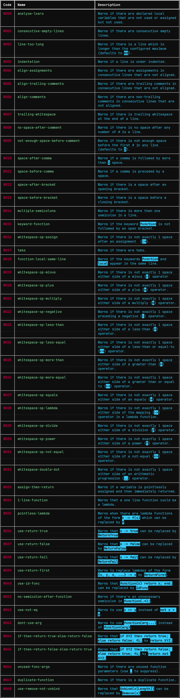

*********************************************************
README - gaplint - by James D. Mitchell and Simon Tollman
*********************************************************

``gaplint`` automatically checks the format of a GAP file according to
some conventions, which are somewhat configurable. It prints the nature
and location of instances of any instances of violations of these
conventions (see below for more details).

Installation
============

Simply run::

    $ pip install gaplint

Usage
=====

To use it::

    $ gaplint --help

List of all rules
=================

To disable all rules for a particular file you can add the line::

    # gaplint: disable = all

to the start of the file before any lines that contain any code. All
rules are enabled by default.

You can obtain an explanation of a rule at the command line using the
``--explain`` flag, i.e. ``--explain W000,W001``.  

Configuration
=============

Certain parameters can be configured, for example, the maximum number of
characters permitted per line. All rules are enabled by default but can
be disable at the command line, by comments in the file itself, or in a
configuration file ``.gaplint.yml``.

**Configuration keywords:**

- ``columns``: maximum number of characters per line. *Defaults to 80*.
- ``disable``: rules can be disabled using their name or code.
  *Defaults to no rules disabled*.
- ``dupl-func-min-len``: only warn about duplicate functions with at least
  this many lines. *Defaults to 4*.
- ``enable``: rules can be enabled using their name or code. *Defaults to all rules enabled*.
- ``indentation``: minimum indentation of nested statements. *Defaults
  to 2*.
- ``max-warnings``: maximum number of warnings before ``gaplint``
  aborts. *Defaults to 1000*.

A list of all of the rules that ``gaplint`` can apply is given below.

You can alter the configuration in various places, the order of
precedence of these is governed by the hierarchy described below. A
preference given somewhere higher in the hierarchy will be
given precedence. 

Configuration
=============

Via the command line
^^^^^^^^^^^^^^^^^^^^

These preferences will be applied for a single run of ``gaplint`` only (though
multiple files may be linted in this run). To configure ``gaplint`` to be run
on ``file1``, ``file2``, ..., with preferences as in the example above, we
enter the following into the command line::

       gaplint --columns=100 --indentation=4 --disable=W002,W028 file1 file2 ...

Via comments in source files
^^^^^^^^^^^^^^^^^^^^^^^^^^^^

Any rule, including ``all``, can be suppressed for a specific line or for a
whole file:

* To supress a rule(s) for a given line, include the following after the line
  of code for which the rule is to be suppressed::

   # gaplint: disable=<name_or_code>, <name_or_code> ...

*  If the above is too long to fit after the relevant line of code,
   suppressions can be declared in the line above for the line below
   by including ``(nextline)``::

   # gaplint: disable(nextline)=<name_or_code>, <name_or_code>, ...

*  If rules have been suppressed for a given line using both the
   in-line and *nextline* options, the union of the two rule sets
   given for suppression will be disabled for the line.

*  To suppress rules for a whole file the following must be included
   before any code is written (i.e. either as the first line of a GAP
   file, or preceded by any combination of only whitespace, empty
   lines and comments)::

   # gaplint: disable=<name_or_code>, <name_or_code>, ...

Via a configuration file
^^^^^^^^^^^^^^^^^^^^^^^^

   To configure ``gaplint`` as in the above examples, create a
   ``.gaplint.yml`` file containing the following lines:

   .. code:: yaml

       columns: 100
       indentation: 4
       disable:
       - W002
       - W028

``gaplint`` looks for the ``.gaplint.yml`` file in the current
directory, and its ancestors, until it reaches a directory containing
a ``git`` repository or the ``.gaplint.yml`` file is located. If
there is no ``.gaplint.yml`` file, then the default configuration
options are used. The options configured in ``.gaplint.yml`` are
applied to every file on which ``gaplint`` is run from the current
directory unless overruled higher in the hierarchy.

